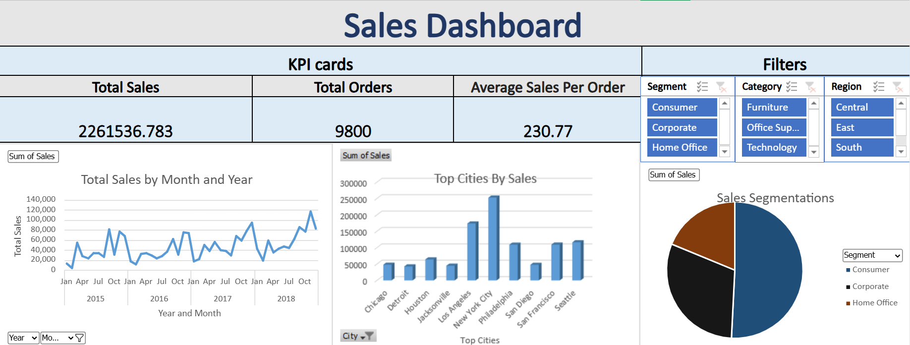

# Sales Dashboard: Excel

An interactive Excel dashboard that turns raw transactional data into a clear snapshot of business performance across cities, segments, and time, with no code required to explore it.



**At a glance:** $2.26M total sales · 9,800 orders · $230.77 average order value · 4 years of data (2015 to 2018) · 3 interactive slicers

## Problem

Raw sales records are hard to read and slower to act on. Decision makers need to see total performance, top markets, and revenue trends at a glance, and to filter by segment, category, or region without asking an analyst to rebuild the report each time.

## Key Metrics

| Metric | Value |
|---|---|
| Total Sales | $2,261,537 |
| Total Orders | 9,800 |
| Average Sales Per Order | $230.77 |
| Data Range | 2015 to 2018 |
| Top City by Sales | New York City |

## Dashboard Overview

| Component | Function |
|---|---|
| KPI Cards | Total Sales, Total Orders, and Average Order Value visible at a glance |
| Monthly Sales Trend | Line chart tracking revenue over time from 2015 to 2018 |
| Top Cities by Sales | Bar chart highlighting the best-performing markets |
| Sales by Segment | Pie chart breaking down Consumer, Corporate, and Home Office |
| Slicers | Filters for Segment, Category, and Region that update every visual |

**Slicer options**
- **Segment:** Consumer, Corporate, Home Office
- **Category:** Furniture, Office Supplies, Technology
- **Region:** Central, East, South, West

## Key Design Decisions

**Pivot-driven visuals, not static charts.** Every chart and KPI is built on pivot tables and pivot charts, so the whole dashboard recalculates from the underlying data instead of relying on hard-coded numbers.

**One set of slicers controlling every visual.** Segment, Category, and Region filters apply across all charts at once, so a viewer can narrow the entire dashboard to a single view in one click.

**Executive-first layout.** KPI cards sit at the top so the headline numbers are visible before any chart is read.

## Tools & Technology

| Tool | Purpose |
|---|---|
| Excel Pivot Tables | Data aggregation and summarization |
| Pivot Charts | Visual representation of KPIs and trends |
| Slicers | Interactive filtering across all visuals |
| KPI Cards | Executive-level performance snapshot |

## Applications

- **Executive Reporting**: a one-screen performance snapshot for leadership
- **Market Analysis**: spot top-performing cities and segments instantly
- **Trend Tracking**: follow monthly revenue patterns across four years
- **Self-Service Exploration**: filter by region, category, or segment without any coding

## How to Use

1. Download `Sales Dashboard.xlsx` from this repository.
2. Open it in desktop Excel (slicers work best in Excel 2013 or later).
3. Click any slicer button (Segment, Category, or Region) to filter the dashboard.
4. Click a selected slicer button again, or use the clear filter icon, to reset the view.

## Project Structure

```
├── Sales Dashboard.xlsx    # Main interactive Excel dashboard
├── images/                 # Screenshots used in this README
│   └── sales-dashboard.png
└── README.md
```
